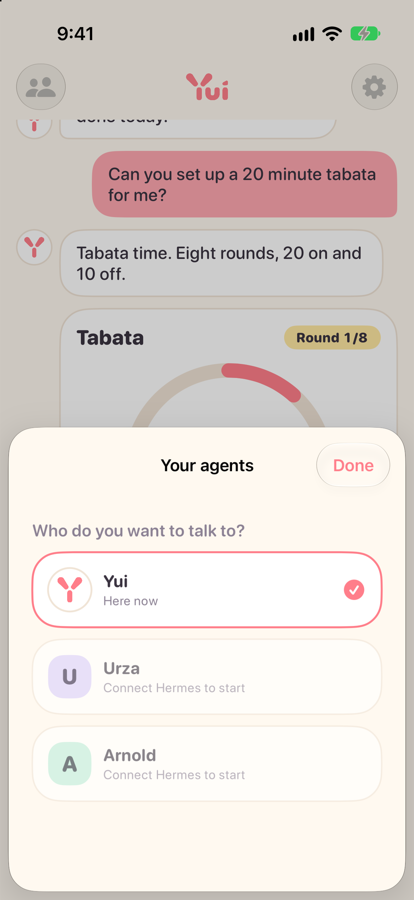
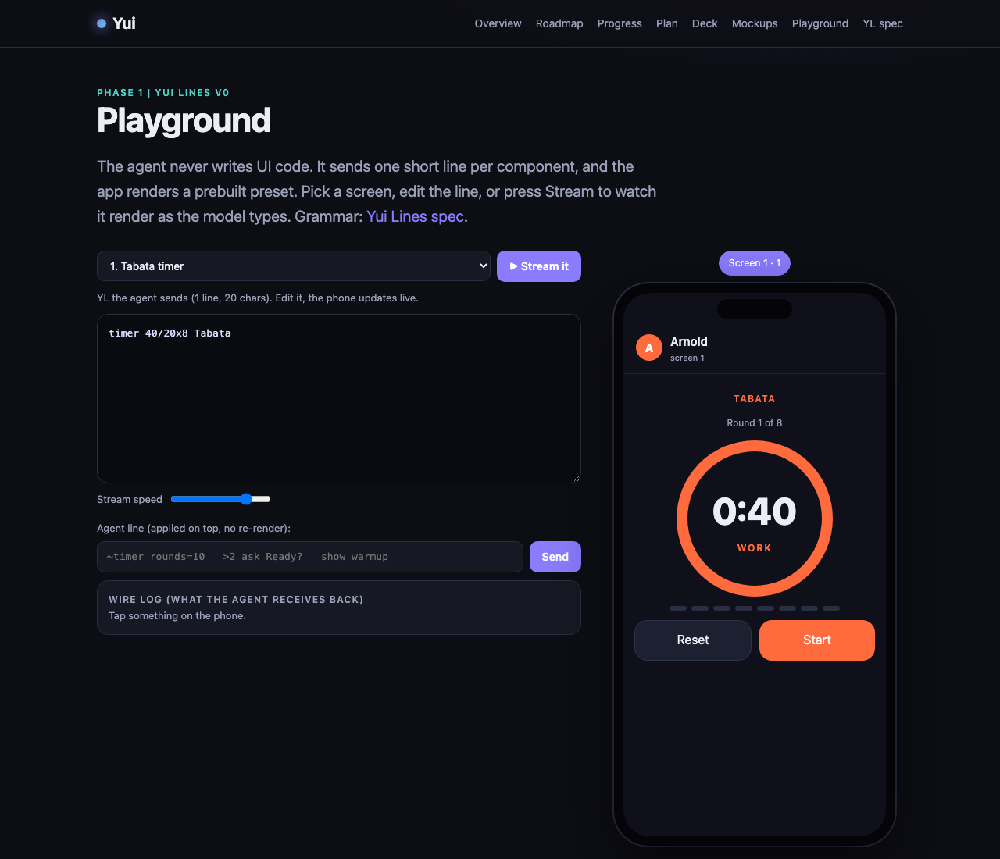

# Yui

Meet Yui, a generative user interface. Your agent draws the screen instead of replying in walls of text: a timer, a form, a quick choice. You chat like normal, and when a button or a timer would work better than text, the agent puts one on the screen. Your taps go straight back to it. Native on iPhone, Hermes first.

It is not another chatbot. Yui brings no brain of its own. You bring the agent (Hermes first, others later), and Yui gives it a face, a voice and a screen it can draw on.

This repo is the hub: the public roadmap, the progress log, the Yui Lines spec and the site at [yuigui.com](https://www.yuigui.com). The iOS app and the Hermes plugin live in [postscarcityai/yui](https://github.com/postscarcityai/yui).

<p>
  
  
</p>

## Yui Lines

The agent never writes UI code or a JSON tree. It sends one short line per component, and the app renders a prebuilt preset the moment the line arrives:

```
timer 40/20x8 Tabata
ask "Log this set?"
choose "What are we training?" Push|Pull|Legs +other
```

Try it in the [playground](https://www.yuigui.com/playground): edit a line and watch the phone update, or press Stream to see it render as a model types.



Against the leanest possible JSON, Yui Lines saves about a third of the tokens. Against JSON the way models usually write it, the saving is 2.6x to 3.9x. Numbers and method: [spec/BENCHMARK.md](spec/BENCHMARK.md).

## What is in here

| Path | What it is |
| --- | --- |
| `spec/YL.md` | Yui Lines grammar, v0 |
| `spec/conformance/` | Test vectors every Yui Lines parser must pass |
| `spec/CHANNEL.md` | The short guide an agent gets on every Yui turn |
| `spec/AGENTS.md` | How agents are registered and paired with the app |
| `spec/BENCHMARK.md` | Token counts, Yui Lines vs JSON |
| `site/` | yuigui.com (Next.js). Reference parser in `site/lib/yl/yl.mjs` |
| `bench/` | Parser tests and the token benchmark |
| `ROADMAP.md` | Phases, from hub site to App Store |
| `docs/business/` | Business plan and revenue notes, in the open |
| `docs/thoughts/` | Thoughts, Yui's blog at /thoughts: releases, whys and open calls |
| `pitch/` | The original pitch recording, transcript and summary |
| `brand/` | Logo files |

## Run it

You need Node 20 or newer.

```sh
# the site
cd site
npm install
npm run sync      # copies ROADMAP.md, spec/YL.md and the benchmark into site/content
npm run dev       # http://localhost:3000

# parser tests and the token benchmark
cd bench
npm install
npm test
npm run bench
```

## Connect an agent

Yui talks to Hermes through a platform plugin. Install it into a Hermes profile and that profile shows up as its own thread in the app, with the same memory it has on Telegram. Setup steps are in the app repo: [postscarcityai/yui](https://github.com/postscarcityai/yui#connect-hermes).

Other agent frameworks can speak the same protocol. Start with `spec/CHANNEL.md` and `spec/AGENTS.md`.

## Built in public

Every change that ships adds a line to the [progress log](https://www.yuigui.com/progress), and a weekly update goes out on Fridays. How that works: [BUILD-IN-PUBLIC.md](BUILD-IN-PUBLIC.md).

## Contributing

Issues and pull requests are welcome. A new Yui Lines parser in another language is one of the most useful things you could build. See [CONTRIBUTING.md](CONTRIBUTING.md) and the [Code of Conduct](CODE_OF_CONDUCT.md). Found a security problem? Please read [SECURITY.md](SECURITY.md) first.

## License

[Apache-2.0](LICENSE). Copyright 2026 PostScarcity AI.
