# Connectors

A connector lets your agent use a tool you already have: your calendar, your mail, your CRM. You sign in to it once, on the tool's own page, and after that the agent can ask it things for you. Yui shows you what each tool allows before you say yes, and shows you anything the agent changes.

Status: step 1 (YUI-39). This page and a saved flow, `connect`, that runs in the playground (pick "Flow: connect your tools", then "Connect: the sign-in buttons after the flow"). Nothing signs in yet: no Google or HubSpot app is registered, and the sign-in buttons open this page. Step 2 wires real sign-in on the agent's host (section 9).

## 1. What a connector is

A connector is an MCP server that you sign in to once with OAuth. MCP (Model Context Protocol) is the open standard agents use to call tools; the big tools now run their own MCP servers, so the agent talks to Google or HubSpot directly and Yui never sits in the middle of that call.

Three parts, each with one job:

- **The tool's MCP server** (Google's, HubSpot's) does the work: it finds a free hour, searches mail, looks up a deal. It only answers requests that carry your sign-in.
- **The agent** (Hermes today, on your own computer) is the MCP client. It holds the sign-in and decides when to call a tool.
- **Yui** draws the parts you see: the consent in plain words, the sign-in button, and the result as a screen. It never holds the sign-in and never sees your password.

## 2. The first three

| Tool | MCP server | What the agent can do | What it cannot do | Status of the server |
|---|---|---|---|---|
| Google Calendar | `https://calendarmcp.googleapis.com/mcp/v1` | list your calendars, list and search events, find a time that works (`suggest_time`) | share your calendar or change who sees it | Google Workspace Developer Preview |
| Gmail | `https://gmailmcp.googleapis.com/mcp/v1` | search threads, read messages, add and remove labels, write drafts | send mail: the server has no send tool | Google Workspace Developer Preview |
| HubSpot | `https://mcp.hubspot.com` | read contacts, companies, deals and activity; create and edit records, notes and tasks | see anything your own HubSpot login cannot see | generally available |

Sources: Google's [Configure the Google Workspace MCP servers](https://developers.google.com/workspace/guides/configure-mcp-servers) and [Configure the Calendar MCP server](https://developers.google.com/workspace/calendar/api/guides/configure-mcp-server); HubSpot's [Integrate AI tools with the HubSpot MCP server](https://developers.hubspot.com/docs/apps/developer-platform/build-apps/integrate-with-the-remote-hubspot-mcp-server) and [the GA note](https://developers.hubspot.com/changelog/remote-hubspot-mcp-server-is-now-generally-available). Read September 2026; check them again before step 2.

What each one needs from us before anyone can sign in:

- **Google** (both servers): a Google Cloud project with the Gmail and Calendar APIs and their MCP services (`gmailmcp.googleapis.com`, `calendarmcp.googleapis.com`) turned on, an OAuth client, and a consent screen that lists the scopes. The servers are in Google's Developer Preview, so the project has to be in that program.
- **HubSpot**: an MCP auth app made in a HubSpot developer account, which gives a client id, and a redirect URL that matches ours. Sign-in uses OAuth with PKCE, which HubSpot requires.

## 3. Scopes, in plain words

Every sign-in asks for scopes: the exact permissions. Tools name them like `gmail.compose`, which means nothing to most people. Yui shows each tool's scopes as sentences, on the consent step, before the tool's own page opens.

| Tool | Scopes it asks for | What Yui says |
|---|---|---|
| Google Calendar | `calendar.calendarlist.readonly`, `calendar.events.readonly`, `calendar.events.freebusy` | "It can see your calendars and events and find a time that works." |
| Google Calendar, later | `calendar.events` | "Adding or moving an event is a separate ask, the first time you want one." |
| Gmail | `gmail.readonly`, `gmail.compose` | "It can search and read your mail, add labels and write drafts. It has no send button: every draft waits in Gmail for you." |
| HubSpot | set by HubSpot from the server's tools and what you grant on its page | "It can look up contacts, companies and deals, add notes and tasks, and update a record when you ask. It sees only what your own HubSpot login can see." |

Two honest notes the consent step keeps in mind:

- Google's guide lists read-only Calendar scopes, while the server also has `create_event`, `update_event` and `delete_event`. So Calendar starts read-only, and the first time you ask for an event to be added, Yui asks again for `calendar.events`, with its own plain sentence. Ask for more only when it is needed.
- Google shows `gmail.compose` as "manage drafts and send email", because drafts and sending share one permission. The Gmail MCP server has no send tool, and Yui's rule stands: no mail goes out on your behalf without you. If Google's page says send, Yui's step says why.

## 4. The connect flow

A saved flow, like [Onboarding](ONBOARDING.md). Send `flow connect` to run it as is; to offer only the tools your agent supports, send it inline and keep the ids and edges.

| Step | Screen | What it asks |
|---|---|---|
| `hi` | page | what connecting means: you sign in on the tool's page, never in Yui |
| `tools` | pick | Google Calendar, Gmail, HubSpot |
| `cal` `mail` `crm` | choose, one per tool picked | "Let your agent use it?" Allow or Not now, under the tool's name and its scopes in plain words |
| `sees` | page | what the agent sees, and how to switch a tool off |
| `signin` or `skip` | page | what comes next: a sign-in button per tool allowed, with three things to ask; or nothing connected, and that's fine |

```mermaid
flowchart TD
  %% hi: page "Connect your tools" body="Sign in once and your agent can use them for you. You pick the tools and see what each one allows before anything happens." points="You sign in on Google or HubSpot, never in Yui|Yui never sees your password|Switch any tool off later, from the drawer"
  hi([Start]) --> tools
  %% tools: pick "Which tools should your agent use?" "Google Calendar"|Gmail|HubSpot
  tools[Your tools] --> has_cal{Calendar?}
  has_cal -->|tools=Google Calendar| cal
  has_cal --> has_mail
  %% cal: choose "Let your agent use it?" Allow|"Not now" tag=Calendar title="Google Calendar" body="It can see your calendars and events and find a time that works. Adding or moving an event is a separate ask, the first time you want one. It never shares your calendar."
  cal[Calendar] --> has_mail{Gmail?}
  has_mail -->|tools=Gmail| mail
  has_mail --> has_crm
  %% mail: choose "Let your agent use it?" Allow|"Not now" tag=Mail title="Gmail" body="It can search and read your mail, add labels and write drafts. It has no send button: every draft waits in Gmail for you."
  mail[Gmail] --> has_crm{HubSpot?}
  has_crm -->|tools=HubSpot| crm
  has_crm --> sees
  %% crm: choose "Let your agent use it?" Allow|"Not now" tag=CRM title="HubSpot" body="It can look up contacts, companies and deals, add notes and tasks, and update a record when you ask. It sees only what your own HubSpot login can see."
  crm[HubSpot] --> sees
  %% sees: page "What your agent sees" body="Only what a tool sends back when the agent asks it something. Your sign-in stays with your agent, never in the Yui app and never in a Yui database." points="Anything it changes shows up here first|Switch a tool off from the drawer|Or remove it on Google or HubSpot"
  sees[What it sees] --> ready{Any allowed?}
  ready -->|cal=Allow or mail=Allow or crm=Allow| signin
  ready --> skip
  %% signin: page "Next: one sign-in each" body="Send this and your agent answers with a sign-in button for each tool you allowed. Then you can ask it things like:" points="Find me an hour with Dana this week|What came in today that needs me?|Who is my next call, and what did we say last time?"
  signin[Sign in next] --> fin((Connected))
  %% skip: page "Nothing connected, and that's fine" body="Your agent works without them. Connect a tool any time from the drawer."
  skip[Nothing yet] --> fin
```



The source lives in `site/lib/yl/starter-flows.mjs`; this block is a copy.

The flow sends one event at the end:

```
{"id":"connect","preset":"flow","flow":{"tools":["Google Calendar","HubSpot"],"cal":"Allow","crm":"Allow"},"path":["hi","tools","cal","crm","sees","signin"]}
```

## 5. Why the sign-in is not a step

A saved flow is the same text for everyone. A real sign-in link is not: the agent's host makes a fresh one for each person and each try (a `state` value and a PKCE challenge, so a stolen link is useless). So the flow ends with consent, and the agent answers the event with the buttons. Only tools marked Allow get one.

## 6. Sign in

The agent's answer to the event, one `card` per tool allowed. The button opens the tool's own sign-in page in Safari; Yui sends nothing to the chat on the tap.

```
say "Two sign-ins and I can get to work."
card "Google Calendar" "See your events and find a time that works." sub="You sign in on Google" cta="Sign in with Google" url=https://www.yuigui.com/developers/connectors#6-sign-in
card "HubSpot" "Look up contacts and deals, add notes and tasks." sub="You sign in on HubSpot" cta="Sign in with HubSpot" url=https://www.yuigui.com/developers/connectors#6-sign-in
choose "Once you're in, what first?" "Find an hour this week"|"Who is my next call?" +other
```

In step 1 every `url` points here, at this section. In step 2 it is the link the host made. A `card` only opens `https:` links (YL.md, card), so a sign-in link is always a real web page the person can check.

When the sign-in comes back, the host tells the agent, and the agent says so with a screen: what is now connected and one question with real next steps. No "Got it" button.

## 7. Who holds the sign-in

After you sign in, the tool hands back tokens: a short-lived one for calls and a refresh token that lasts. Whoever holds them can act as you, so the rule is short:

- **Never** in the Yui app in plain text: not in its settings, its logs or the chat.
- **Never** in a Yui table in the clear. Yui's database stores which tools are connected (a name and a date), not the tokens.
- **Never** in a chat line, a YL line or an event. The agent is never handed a token as text.

Where they live, two options:

1. **On the agent's host** (step 2). The agent is the MCP client, so its host (Hermes on your own computer) keeps the tokens in its own credential store and refreshes them. They never leave your machine. This is the default, and the only option for now.
2. **A vault, later.** When the hosted agent (YUI-37) runs your agent for you, the tokens need a home that is not your computer. That rides the key vault (YUI-34), which keeps secrets encrypted and hands them only to the agent that owns them.

## 8. What the agent sees, and switching a tool off

The agent sees only what a tool sends back when it asks: the events in a week, the threads a search found, one deal. It does not get a copy of your mailbox or your CRM. What it changes (a draft, a note, an event) shows up in the chat as a screen first.

Switching a tool off, two ways:

- **From the drawer** in Yui (step 2): each connected tool gets a row under the agent's About, with Switch off. The host deletes the tokens and tells the tool to revoke them.
- **On the tool itself**, any time, even without Yui: Google's [Third-party apps and services](https://myaccount.google.com/connections), or HubSpot's connected apps in your account settings. The agent's next call fails, and it says the tool is off instead of guessing.

## 9. Next

- **Step 2, real sign-in on the host.** The host runs the OAuth flow (PKCE, its own redirect), stores the tokens, and hands the agent the three MCP servers. Before any code: a Google Cloud project in the Workspace Developer Preview with a consent screen, and a HubSpot MCP auth app. Each of those is an app registered in Chris's name, so it waits for his sign-off.
- **Step 3, the drawer.** Connected tools listed per agent, with Switch off.
- **More tools**, one at a time, each with its scopes written in plain words before it ships.
