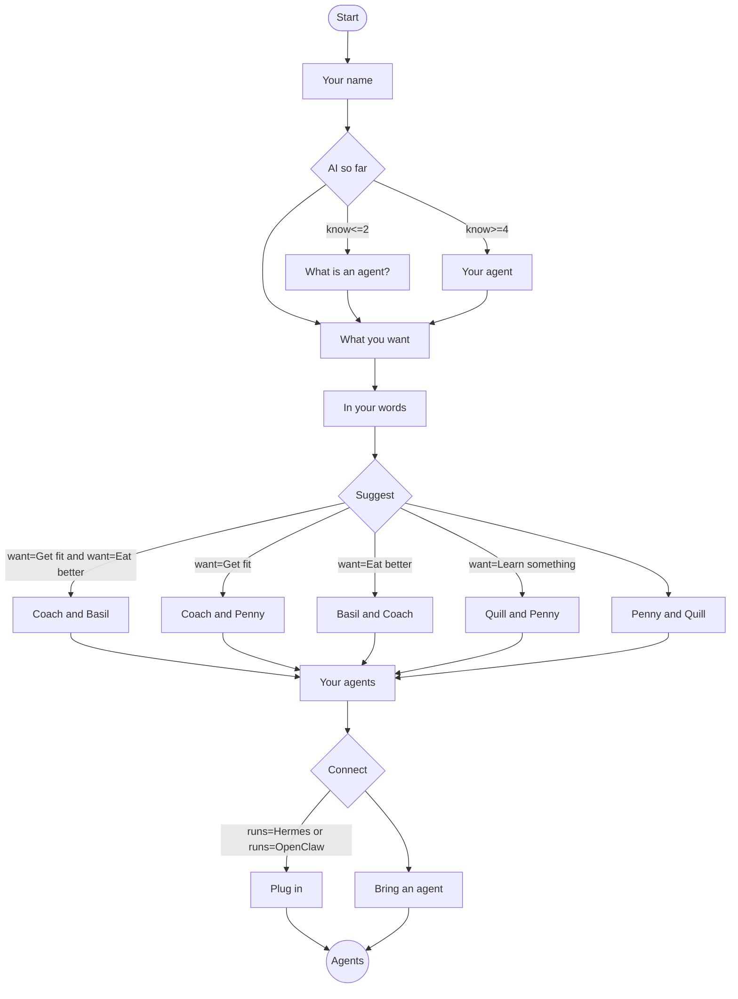

# Onboarding

The first thing a new person sees in Yui is not a chat box. It is Yui, asking three quick questions on full screens, then suggesting their first agents. Every answer shapes the next screen.

Status: step 1 (YUI-38). The interview is a saved flow, `onboarding`, written below and runnable in the playground (pick "Flow: meet yui"). The app runs it natively in step 2, after 0.2.0. Yui has no built-in agent yet (that is YUI-37, Phase 4), so the interview never claims Yui answers on its own: it ends by saying how to bring one.

## 1. The screens

One screen per question, on the stage, with Back and Next and a review at the end, the way every flow runs ([Flows](FLOWS.md)).

| Step | Screen | What it asks | What it changes |
|---|---|---|---|
| `hi` | page | "Hi, I'm Yui": three questions, then agents | nothing |
| `you` | form | "What should I call you?" (`name`, required) | the agent greets you by name after |
| `know` | slide 1 to 5 | "How much do you know about AI?" Brand new to I run agents | 1 or 2 gets a page on what an agent is; 4 or 5 asks if you run one |
| `basics` | page | "An agent, in one line" | only for 1 or 2 |
| `runs` | choose | "Do you run an agent already?" Hermes, OpenClaw, Something else, Not yet | Hermes or OpenClaw gets the plug-in ending |
| `want` | pick | "What do you want help with?" Get fit, Eat better, Get organized, Learn something, or your own | picks the suggested pair |
| `words` | mic | "Tell me more, in your own words" | goes to the agent, for tailoring |
| `duo` `fit` `food` `learn` `organized` | page | the two agents suggested, one line each and their look | one of the five, by `want` |
| `team` | pick | "Which ones do you want?" Coach, Basil, Penny, Quill | the agents to set up |
| `plug` or `bring` | page | how connecting works today | by `runs` |

The suggestion follows the first rule that holds, in this order: Get fit and Eat better both (Coach and Basil), Get fit (Coach and Penny), Eat better (Basil and Coach), Learn something (Quill and Penny), anything else (Penny and Quill).

## 2. The starter agents

| Name | Job, in one line | Look (YL `theme` set) |
|---|---|---|
| Coach | A trainer: plans your workouts and runs the timer. | `coach` |
| Basil | A nutritionist: turns a photo of a meal into macros. | `matcha` |
| Penny | A personal assistant: keeps your lists, reminders and plans. | `studio` |
| Quill | A study buddy: quizzes you with cards and slides. | `wizard` |

Each look is a set the app already ships ([Agents](AGENTS.md), "Look"), so a new agent is recognizable from its first reply.

## 3. What connecting means today

Yui draws the screens. The agent runs somewhere else, on the person's own machine, until the hosted agent (YUI-37) ships.

- **Runs Hermes or OpenClaw** (`plug`): install the Yui plugin and pair with a code. Each agent picked becomes a profile on it, with its look. The steps: yuigui.com/start.
- **Everyone else** (`bring`): "Yui brings the screens, you bring the agent." Set up Hermes once, free, on your own computer, then the same steps.

The interview never says Yui will answer by itself, and never asks for a password, a card or a key.

## 4. The flow

The whole interview as a saved flow. GitHub draws it as a chart; the phone runs it. Send `flow onboarding` to run it as is. To tailor it (a coach's clients, a team), send it inline with your own wording and keep the ids and edges.



The source lives in `site/lib/yl/starter-flows.mjs`; this block is a copy.

## 5. The event

One event at the end, like every flow:

```
{"id":"onboard","preset":"flow","flow":{"you":{"name":"Sam"},"know":1,"want":["Get fit","Eat better"],"words":"Lose ten pounds before June","team":["Coach","Basil"]},"path":["hi","you","know","basics","want","words","duo","team","bring"]}
```

What the agent does with it: greet the person by `you.name`, and for each name in `team` suggest the profile to create (its name, job and look from section 2), using `words` to tailor the first message. The path tells it which ending the person read.

## 6. Next

- Step 2 (after 0.2.0): the app runs it natively on first launch, and a finished interview creates the picked agents in the drawer with their looks, waiting to be connected.
- With the hosted agent (YUI-37), the ending changes: the picked agents answer right away, no setup.
